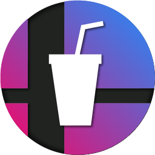

<!-- PROJECT LOGO -->
<br />
<p align="center">
  
  <h3 align="center">
  Smash Soda Overlay
  </h3>

  <p align="center">
    Overlay application to accompany Smash Soda
    <br />
    <a href="https://github.com/MickeyUK/SmashSoda/releases">Latest Release</a>
    ·
    <a href="https://github.com/MickeyUK/SmashSoda/issues">Report Bug</a>
    ·
    <a href="https://github.com/MickeyUK/SmashSoda/issues">Request Feature</a>
  </p>
</p>

<!-- TABLE OF CONTENTS -->
<details open="open">
  <summary><h2 style="display: inline-block">Table of Contents</h2></summary>
  <ol>
    <li>
      <a href="#about-the-project">About The Project</a>
    </li>
    <li><a href="#setup">Setup</a></li>
    <li><a href="#contributing">Contributing</a></li>
    <li><a href="#license">License</a></li>
    <li><a href="#contact">Contact</a></li>
    <li><a href="#acknowledgements">Acknowledgements</a></li>
  </ol>
</details>


## About the Project

Here is the source code for the overlay application included with <a href="https://github.com/mickeyuk/SmashSoda">Smash Soda</a>. It has been developed with Electron. It is not intended to be run standalone, and won't work with <a href="https://github.com/v6ooo/ParsecSodaV">Parsec Soda V</a>'s Web Sockets widget.

The source code is made public in case anybody wants to modify and compile for their own purposes (or contribute to the project!).

Issues and feature requests should be made in the <a href="https://github.com/MickeyUK/SmashSoda/issues">Smash Soda repository</a>.

<table>
    <tr>
        <td align="center">
           <a href="https://github.com/MickeyUK/SmashSoda/releases">
               
               <div>Download</div>
           </a>
           <div>Download latest<br>version</div>
        </td>
        <td align="center">
           <a href="https://github.com/MickeyUK/SmashSoda/issues">
               
               <div>Issues</div>
           </a>
           <div>Report issues and<br>request features</div>
        </td>
        <td align="center">
           <a href="https://discord.gg/9ZHmwce">
               
               <div>Discord</div>
           </a>
           <div>Join the Discord<br>community!</div>
        </td>
        <td align="center">
           <a href="https://github.com/MickeyUK/SmashSoda/wiki">
               
               <div>Wiki</div>
           </a>
           <div>Read the full wiki<br>guide here!</div>
        </td>
    </tr>
</table>

## Setup

The overlay is built in the <a href="https://wails.io/">Wails</a> framemwork. Follow their guide for setting up a development environment <a href="https://wails.io/docs/next/gettingstarted/installation">here</a>. (Note this overlay is compatible with Smash Soda version 6 onwards).

Once wails is installed, clone the project, cd in to the frontend subfolder, and install the node packages.

```
git clone https://github.com/Smash-Soda-Team/smash-soda-overlay
cd smash-soda-overlay/frontend
npm install
```

To run the overlay in dev mode:

```
wails dev
```

To build the application:

```
wails build
```

The overlay has a new theming system. You can put custom CSS files inside the themes folder alongside the built app, and select themes in Smash Soda. When developing a theme, you can run the overlay in "design mode". This will stop the overlay from trying to connect to Smash Soda and display some placeholder widgets on the overlay:

```
wails dev -appargs design
```

----

Socket messages from Smash Soda to come in this JSON format:
```json
{
  "event": "event name",
  "data": {}
}
```
This is than transmitted across the app with the eventBus, which I just hooked on to the window object to keep things simple. You can then listen to events like:
```ts
window.$eventBus.on('event name', (data: any) => {
  // Do thing
});
```

## Contributing

See the [open issues](https://github.com/MickeyUK/SmashSoda/issues) for a list of proposed features (and known issues).

Would you like to contribute to the project? That's great! Here's what you do:


1. Open a new issue reporting what you're going to do.
2. Fork this repository.
3. Create a branch for your feature.
4. Make your local changes.
5. Submit a pull request.

If this is helpful to you and you'd like to say thanks, you could <a href="https://ko-fi.com/mickeyuk">buy me a coffee</a> if you want!

## License

See `LICENSE.txt` for more information.


## Contact


Project Link: [https://github.com/MickeyUK/SmashSoda](https://github.com/MickeyUK/SmashSoda)


<!-- ACKNOWLEDGEMENTS -->
## Acknowledgements

* [MickeyUK] - [GitHub](https://github.com/MickeyUK) - Smash Soda Project Lead